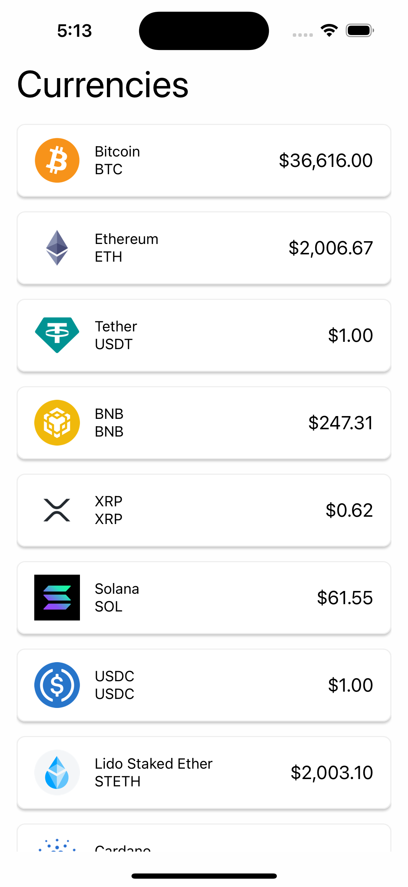

## Test Pluriza

- Clona el repo

```bash
git clone
```

- Instala las dependencias del proyecto con tus manejador de paquetes (yarn, npm u otro)

```bash
yarn
```

- Ingresa a la carpeta IOS del projecto y ejecuta, donde se abrirá XCode

```bash
xed .
```

- Ejecuta el proyecto manualmente o por shorcut dentro de XCode

```bash
cmd + r
```

- Presentacion visual del proyecto



